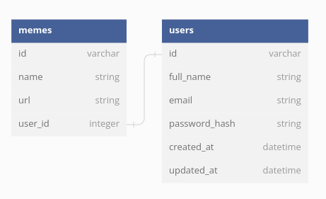

# MeMe Club(Back-End)
==========================

## DESCRIPTION
**MeMe Club** is a Meme Generating full stack web application that allows users to register, log in and browse through a library of memes. It also allows users to add, update and delete their own memes onto the platform.

This project is the phase III capstone project at Moringa School of Technology. It's a compilation of the skills learnt through the software development course, in the third phase that covers the basics to Ruby. It mainly puts focus on REACT.js for Front-end web programming, and Ruby .

```
https://github.com/jamnjeri/phase-3-final-project-backend
```
```
https://github.com/jamnjeri/phase-3-final-project-frontend
```

This is specifically the backend for the MeMeClub website.

For the backend, I had 2 models: User and Memes.
* A user has many memes.
* A meme belongs toa specific user.





## REQUIREMENTS

### Prerequisites
* ruby v2.7 
* Create environment variables

### Get Started
To get started you need to do the following:
* Clone the Repository using: 
```
 https://github.com/jamnjeri/phase-3-final-project-backend
```
* Install necessary gems using:
```
bundle install
```
## PROJECT DELIVERABLES
Below are the deliverables that were expected for this project: 
(# for instance methods, .(dot) for class methods)

### Migrations
* A Meme belongs to a User.
* The memes table should have:
    - A name column that stores a string.
    - A url column that stores a string. 
* After creating and running your migration,create your Memes class and use the seeds.rb file to create Meme instances so you can test your code.  

### Object Relationship Methods
* Us Active Record association macros and Active Record query methods where appropriate(i.e. has_many, has_many through and belongs_to).

 * Memes
    * Returns the User instance for this Meme.
    * Meme#user

 * User
    * User#memes
      - Returns a collection of all the Memes for the Product.

## Languages Used
* Ruby

## Author:
   * **Jamila Mathu** - *Initial work* - [jamnjeri](<https://github.com/jamnjeri>)
## Status:
    maintained, and is currently in development
## Version:
    v0.1.0
## Usage

## License

[](https://opensource.org/licenses/MIT)
Copyright (c) 2023 **Mathu Jamila**

